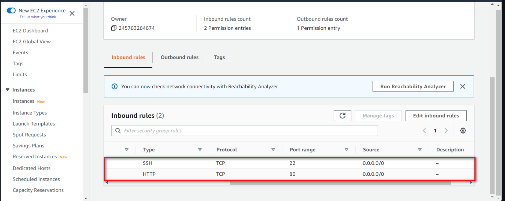
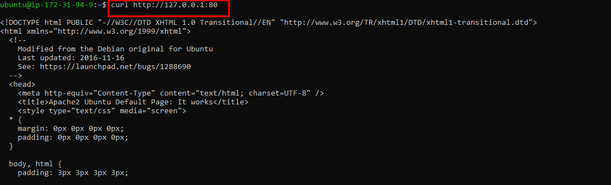
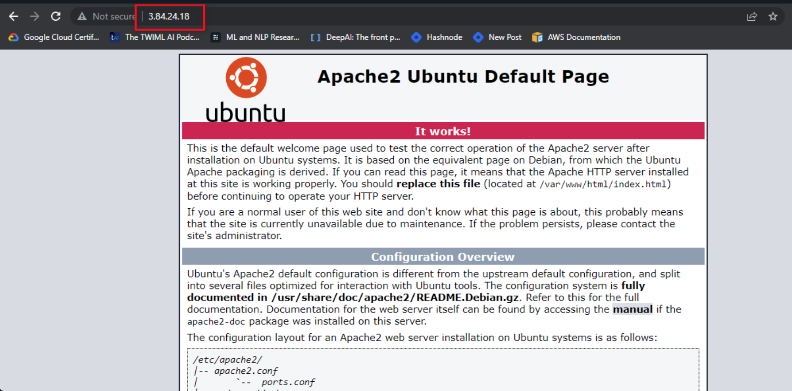
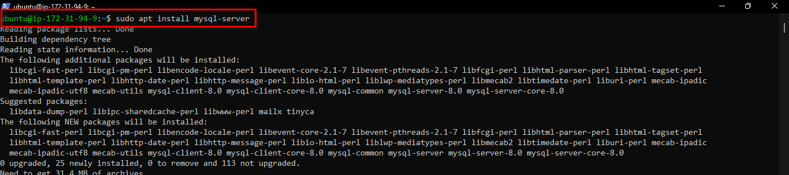
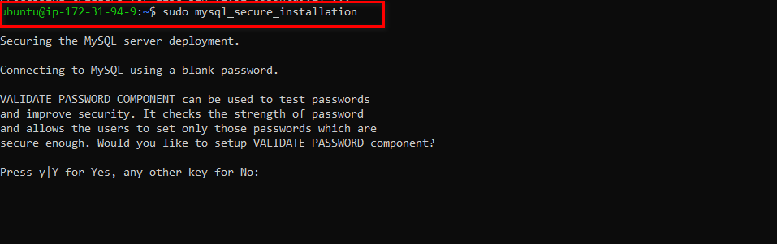
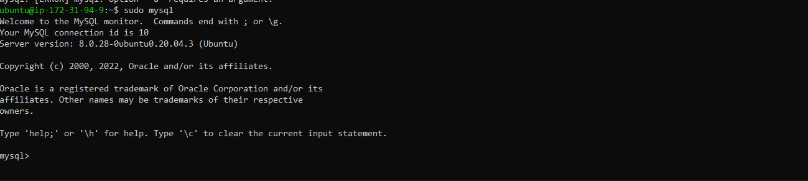
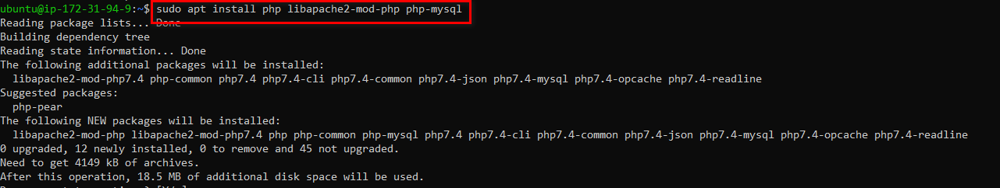
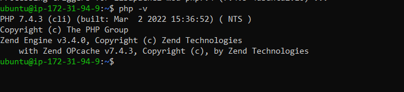

# LAMP STACK IMPLEMENTATION(PROJECT 1)

**A LAMP** Stack is a solution stack that is being used in deploying web applications. It stands for Linux, Apache, MySql and php,perl or python.

**Linux**: this is an operating system which serves as the backbone of the LAMP Stack, and it is actively used in deploying other components.

**Apache**: is a web server software which via HTTP requests processes requests and transmits information via the internet.

**MySQL**: use for creating and maintaining dynamic databases. It supports SQL and relational tables and provides a DBMS(Database Management System).

**PHP,PERL or PYTHON**: this represents programming languages which effectively combines all the elements of the LAMP stack and is used to make web applications execute.

### Creation of EC2 Instance

First we log on to AWS Cloud Services and create an EC2 Ubuntu VM instance. When creating an instance, choose keypair authentication and download `private key(*.pem)` on your local computer.


On windows terminal, `cd` into the directory containing the downloaded private key.Run the below command to log into the instance via ssh:


successful login to instance

### Setting Up Apache Web Server

To deploying the web application, we need to install apache via ubuntu package manager `apt`:

```
#Updating Packages
$ sudo apt update

$ sudo apt install apache2
```


```
#starting apache2 Server
$ systemctl start apache2

#ensuring apache2 starts automatically on system boot
$ systemctl enable apache2

#checking server spunned
$ systemctl status apache2
```


If it shows a green text, it means the web server has been successfully spunned and is live.

### Configuring Security Group Inbound Rules on EC2 Instance

A Security group is a group of rules that acts as a virtual firewall to the type of traffic that enters (inbound traffic) or leaves (outbound traffic) an instance.

When the instance is created, we have a default TCP rule on port 22 opened which is useful for SSH connection to a terminal. In order to ensure that our webpage are being acccessed on the internet, we need to open a TCP port 80 inbound rule.



To check the accessiblity of our web server on the internet, we curl the IP address/DNS name of our localhost.

```
curl http://127.0.0.1:80  or curl http://localhost:80
```



To see if our web application server can respond to requests , use the public ip address of our instance on a web browser. http://`<Public-IP-Address>:80`



### Installing MySQL

We use MySQL as a relational database to store and manage data on our site.

Install mysql using the `sudo apt install mysql` command.



Use the `sudo mysql_secure_installation` command to remove insecure default settings and enable protection for the database.



On successful secure configuration, `sudo mysql` on the terminal to have access to the MySQL DB.



Exit from the MySQL terminal by typing `exit`.

### Installing PHP and its Modules

**PHP** serves as a programming language which is useful for dynamically displaying contents of the webpage to users who make requests to the webserver.

We need to install php alongside its modules, `php-mysql` which is php module that allows php to communicate with the mysql database, `libapache2-mod-php` which ensures that the apache web server handles the php contents properly.

`sudo apt install php php-mysql libapache2-mod-php`.



On successfull installation of php and its modules we can check the version to see if it was properly installed.
`php -v`




